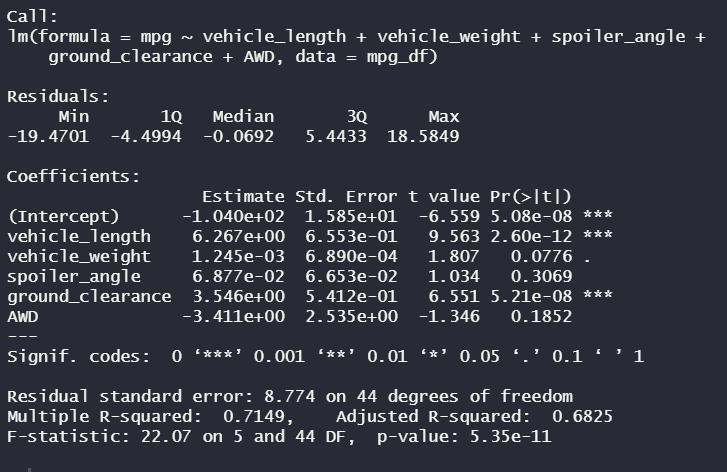
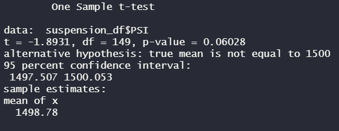
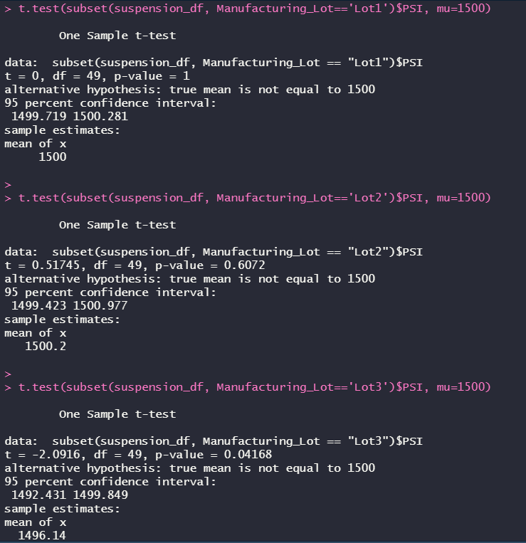

# MechaCar_Statistical_Analysis

Demo of R and its statistical test capabilities.

## Overview:

AutosRUs’ newest prototype, the MechaCar, is suffering from production troubles that are blocking the manufacturing team’s progress. We have been called on to review the production data for insights that may help the manufacturing team. We'll do that with the below analyses.

### Technical Analysis 1: Linear Regression to Predict MPG (Miles Per Gallon)

Multiple metrics, such as vehicle length, vehicle weight, spoiler angle, drivetrain, and ground clearance, were collected for each vehicle and provided to us. We'll perform multiple linear regression analysis to identify which variables in the dataset predict the mpg of MechaCar prototypes:

- Vehicle length and ground clearance have provided a non-random amount of variance to mpg.
- The slope of the linear model is not 0, because these two variables have a significant impact on mpg.
- These variables can be used to predict the mph of a car prototype.

### Technical Analysis 2: Summary Statistics on Suspension Coils

The weight capacities of multiple suspension coils were tested to determine if the manufacturing process is consistent across production lots, and data from those tests was provided to us. We'll create a summary statistics table to show the suspension coil’s PSI continuous variable across all manufacturing lots, as well as each lot's mean, median, variance, and standard deviation. The design specifications for the MechaCar suspension coils dictate that the variance of the suspension coils must not exceed 100 pounds per square inch.

- The variance of the three lots combined meets the design specifications at 62.29356 lbs. as you can see above.
- Individually, only lots 1 and 2 met that goal. Manufacturing lot 3 has a variance of 170.2861224 lbs per square inch, far above the 100 lb limit.

### Technical Analysis 3: T-Tests on Suspension Coils

We'll determine if all manufacturing lots and each lot individually are statistically different from the population mean of 1,500 pounds per square inch by performing t-tests.

We only reject the null hypothesis in one of the four t-tests- the one performed for lot 3. Lot 3 has a mean PSI that is statistically significantly different from the population mean of 1,500 (p-value of below 0.05).

## Proposed Study Design: MechaCar vs Competition

One metric that has not been included in the original MechaCar datasets and would be of interest to consumers is highway fuel efficiency.

- Data showing MPG on highway routes could be provided in two sets- one for MechaCars, and one that combines a representative sample of comparable vehicles across other manufacturers.
- The alternative hypothesis is that MechaCars are statistically more fuel efficient on highway routes than other manufacturers' vehicles.
- This hypothesis would be tested using a two-sample t-test, using one sample from each dataset.
